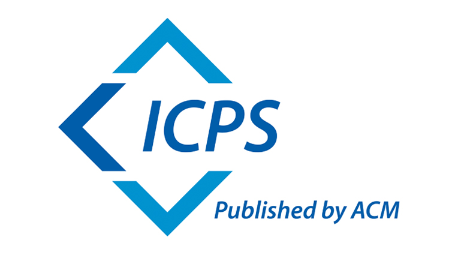

The 26th International Symposium on
Principles and Practice of Declarative Programming, PPDP 2024

Co-located with FM 2024, held 10-11 September 2024 at the Politecnico di
Milano, Italy.

News
-------

- Proceedings have been  [published](https://dl.acm.org/doi/proceedings/10.1145/3678232) in the ACM DL within the ACM International Conference Proceedings Series.
- The [program](#program) has been finalized.
- [Ningning Xie](https://xnning.github.io) (University of Toronto and Google DeepMind) is our joint LOPSTR/PPDP (and FM keynote) speaker.
- The paper "On the Preciseness of Subtyping in Session Types" by
Tzu-Chun Chen, Mariangiola Dezani-Ciancaglini and Nobuko Yoshida has been chosen by the Steering Committee
to receive the "10 Year Most Influential Paper Award".  Mariangiola will give the
related invited talk.
- [Ilaria Castellani](http://www-sop.inria.fr/members/Ilaria.Castellani) (INRIA) is PPDP's invited speaker.

- Registration is still open. Go to the [Registration](https://www.fm24.polimi.it/?page_id=559) page. For PPDP, we suggest the 2-days pass.

## Program

All research talks are held in room [3.1.3](https://www7.ceda.polimi.it/spazi/spazi/controller/Aula.do?evn_init=event&lang=EN&idaula=45&jaf_currentWFID=main)

### Tuesday

----------------

**Session 1: Opening and Keynote**
09:00 - 10:20 Room [O. De Donato](https://www7.ceda.polimi.it/spazi/spazi/controller/Aula.do?evn_init=event&lang=EN&idaula=4513&jaf_currentWFID=main)
**Chair:** Alberto Momigliano

**Speaker:** Ningning Xie
**Talk:** Safe and Easy Compile-Time Generative Programming

######  10:20 - 11:00 Coffee Break

**Session 2**
11:00 - 12:30
**Chair:** Tarmo Uustalu

**11:00 - 11:30**
**Authors:** **Davide Fissore** and Enrico Tassi
**Paper:** Higher-Order unification for free!

**11:30 - 12:00**
**Authors:** José Espírito Santo and **Filipa Mendes**
**Paper:** The logical essence of call-by-name CPS translations

**12:00 - 12:30**
**Authors:** **Maribel Fernandez** and Ian Mackie
**Paper:** Hierarchical Higher-Order Port-Graphs: A Rewriting-Based Modelling Language

---

##### 12:30 - 14:00 Lunch Break

---

**Session 3**
14:00 - 15:30
**Chair:** Roberto Casadei

**14:00 - 14:30**
**Authors:** **Zhengpu Shi** and Gang Chen
**Paper:** Formal Verification of Executable Matrix Inversion via Adjoint Matrix and Gaussian Elimination

**14:30 - 15:00**
**Authors:** **Naoki Yamamoto** and Kazunori Ueda
**Paper:** Grammar-based Pattern Matching and Type Checking for Difference Data Structures

**15:00 - 15:30**
**Authors:** Luca Laboccetta, **Elena Mastria**, Francesco Calimeri, Nicola Leone, Simona Perri, and Giorgio Terracina
**Paper:** Towards Effective ASP-based Stream Reasoning: Facilitate the Reasoning over Patterns of Events

##### 15:30 - 16:00 Coffee Break

**Session 4**
16:00 - 17:30
**Chair:** Carlos Olarte

**16:00 - 16:30**
**Authors:** **Ian Kretz**, Paul Rowe, Clare Parran, and John Ramsdell
**Paper:** Evidence Tampering and Chain of Custody in Layered Attestations

**16:30 - 17:00**
**Authors:** **Christian Skalka** and Joseph Near
**Paper:** Language-Based Security for Low-Level MPC

**17:00 - 17:30**
**Authors:** **Cosimo Laneve**
**Paper:** Reachability Analysis in Micro-Stipula

#### 19:00  FM24 RECEPTION BUFFET
<!-- 
| Time            | Authors                          | Paper                                                                 |
|-----------------|----------------------------------|-----------------------------------------------------------------------|
| 09:00 - 10:20   | Ningning Xie                     | _Keynote and  LOPSTR/PPDP joint speaker_:  Safe and Easy Compile-Time Generative Programming            |
| 10:20 - 11:00   |                                  | Coffee Break                                                          |
| 11:00 - 11:30   | **Davide Fissore** and Enrico Tassi                      | Higher-Order unification for free!                                    |
| 11:30 - 12:00   | José Espírito Santo and **Filipa Mendes**                     | The logical essence of call-by-name CPS translations                  |
| 12:00 - 12:30   | **Maribel Fernandez** and Ian Mackie            | Hierarchical Higher-Order Port-Graphs: A Rewriting-Based Modelling Language |
| 12:30 - 14:00   |                                  | Lunch Break                                                           |
| 14:00 - 14:30   | **Zhengpu Shi** and Gang Chen             | Formal Verification of Executable Matrix Inversion via Adjoint Matrix and Gaussian Elimination |
| 14:30 - 15:00   | **Naoki Yamamoto** and Kazunori Ueda           | Grammar-based Pattern Matching and Type Checking for Difference Data Structures |
| 15:00 - 15:30   | Luca Laboccetta, **Elena Mastria**, Francesco Calimeri, Nicola Leone, Simona Perri, and Giorgio Terracina                | Towards Effective ASP-based Stream Reasoning: Facilitate the Reasoning over Patterns of Events |
| 15:30 - 16:00   |                                  | Coffee Break                                                          |
| 16:00 - 16:30   | **Ian Kretz**, Paul Rowe, Clare Parran, and John Ramsdell                 | Evidence Tampering and Chain of Custody in Layered Attestations       |
| 16:30 - 17:00   | **Christian Skalka** and Joseph Near                      | Language-Based Security for Low-Level MPC                             |
| 17:00 - 17:30   |  **Cosimo Laneve**                        | Reachability Analysis in Micro-Stipula                                |
-->
---

### Wednesday

**Session 5**
09:00 - 10:30
**Chair:** Maribel Fernandez

**09:00 - 09:30**
**Authors:** **Francisco Durán**, Steven Eker, Santiago Escobar, Narciso Marti-Oliet, Jose Meseguer, Rubén Rubio, and Carolyn Talcott
**Paper:** Programming Open Distributed Systems in Maude

**09:30 - 10:00**
**Authors:** Jaime Arias, **Carlos Olarte**, Wojciech Penczek, Laure Petrucci, and Teofil Sidoruk
**Paper:** Model Checking and Synthesis for Strategic Timed CTL using Strategies in Rewriting Logic

**10:00 - 10:30**
**Authors:** Francisco Durán, **Santiago Escobar**, Jose Meseguer, and Julia Sapiña
**Paper:** NuITP: An Inductive Theorem Prover for Equational Program Verification

##### 10:30 - 11:00 Coffee Break

**Session 6**
11:00 - 12:30
**Chair:** Mariangiola Dezani-Ciancaglini

**11:00 - 12:00**
**Speaker:** Ilaria Castellani
**Talk:** _PPDP Invited Talk_: A simple view of multiparty session types

**12:00 - 12:30**
 **Authors:** **Francesco Dagnino** and Luca Padovani
**Paper:** sMALL CaPS: An Infinitary Linear Logic for a Calculus of Pure Sessions

---

##### 12:30 - 14:00 Lunch Break

---

**Session 7**
14:00 - 15:30
**Chair:** Franco Barbanera

**14:00 - 15:00**
**Speaker:** Mariangiola Dezani-Ciancaglini
**Talk:** _10 Year Most Influential Paper Award_: On the Preciseness of Subtyping in Session Types

**15:00 - 15:30**
**Authors:** Ugo Dal Lago and **Luca Padovani**
**Paper:** On the Almost-Sure Termination of Binary Sessions

##### 15:30 - 16:00 Coffee Break

**Session 8**
16:00 - 17:30
**Chair:** Luca Padovani

**16:00 - 16:30**
**Authors:** **Franco Barbanera**, Mariangiola Dezani-Ciancaglini, and Ugo de’Liguoro
**Paper:** Un-projectable Global Types for Multiparty Sessions

**16:30 - 17:00**
**Authors:** Exequiel Rivas and **Tarmo Uustalu**
**Paper:** Concurrent Monads for Shared State

**17:00 - 17:30**
**Authors:** **Roberto Casadei** and Mirko Viroli
**Paper:** Declarative Macro-Programming of Collective Systems with Aggregate Computing: An Experience Report

#### 17:30 Closing

---

<!-- 
| Time            | Authors                          | Paper                                                                 |
|-----------------|----------------------------------|-----------------------------------------------------------------------|
| 09:00 - 09:30   | **Francisco Durán**, Steven Eker, Santiago Escobar, Narciso Marti-Oliet, Jose Meseguer, Rubén Rubio, and Carolyn Talcott                         | Programming Open Distributed Systems in Maude                         |
| 09:30 - 10:00   | Jaime Arias, **Carlos Olarte**, Wojciech Penczek, Laure Petrucci, and Teofil Sidoruk                | Model Checking and Synthesis for Strategic Timed CTL using Strategies in Rewriting Logic |
| 10:00 - 10:30   | Francisco Durán, **Santiago Escobar**, Jose Meseguer, and Julia Sapiña                      | NuITP: An Inductive Theorem Prover for Equational Program Verification |
| 10:30 - 11:00   |                                  | Coffee Break                                                          |
| 11:00 - 12:00   | Ilaria Castellani                | _PPDP Invited Talk_: A simple view of multiparty session types                           |
| 12:00 - 12:30   | **Francesco Dagnino** and Luca Padovani                  | sMALL CaPS: An Infinitary Linear Logic for a Calculus of Pure Sessions|
| 12:30 - 14:00   |                                  | Lunch Break                                                           |
| 14:00 - 15:00   | Mariangiola Dezani-Ciancaglini   | _10 Year Most Influential Paper Award_: On the Preciseness of Subtyping in Session Types |
| 15:00 - 15:30   | Ugo Dal Lago and **Luca Padovani**                        | On the Almost-Sure Termination of Binary Sessions                     |
| 15:30 - 16:00   |                                  | Coffee Break                                                          |
| 16:00 - 16:30   | **Franco Barbanera**, Mariangiola Dezani-Ciancaglini, and Ugo de’Liguoro                      | Un-projectable Global Types for Multiparty Sessions                   |
| 16:30 - 17:00   | Exequiel Rivas and **Tarmo Uustalu**               | Concurrent monads for shared state                                    |
| 17:00 - 17:30   | **Roberto Casadei** and Mirko Viroli                     | Declarative Macro-Programming of Collective Systems with Aggregate Computing: An Experience Report |

Accepted papers
-----------

|                                                |                                                                                       |
|-------------------------------------------------------|--------------------------------------------------------------------------------------------|
| Davide Fissore and Enrico Tassi                       | Higher-Order unification for free!                                                         |
| Francesco Dagnino and Luca Padovani                   | sMALL CaPS: An Infinitary Linear Logic for a Calculus of Pure Sessions                     |
| Roberto Casadei and Mirko Viroli                      | Declarative Macro-Programming of Collective Systems with Aggregate Computing: An Experience Report |
| Francisco Durán, Santiago Escobar, Jose Meseguer, and Julia Sapiña | NuITP: An Inductive Theorem Prover for Equational Program Verification                |
| Francisco Durán, Steven Eker, Santiago Escobar, Narciso Marti-Oliet, Jose Meseguer, Rubén Rubio, and Carolyn Talcott | Programming Open Distributed Systems in Maude |
| Maribel Fernandez and Ian Mackie                      | Hierarchical Higher-Order Port-Graphs: A Rewriting-Based Modelling Language                |
| Ugo Dal Lago and Luca Padovani                        | On the Almost-Sure Termination of Binary Sessions                                           |
| Jaime Arias, Carlos Olarte, Wojciech Penczek, Laure Petrucci, and Teofil Sidoruk | Model Checking and Synthesis for Strategic Timed CTL using Strategies in Rewriting Logic |
| José Espírito Santo and Filipa Mendes                 | The logical essence of call-by-name CPS translations                                         |
| Zhengpu Shi and Gang Chen                             | Formal Verification of Executable Matrix Inversion via Adjoint Matrix and Gaussian Elimination |
| Naoki Yamamoto and Kazunori Ueda                      | Grammar-based Pattern Matching and Type Checking for Difference Data Structures              |
| **Ian Kretz**, Paul Rowe, Clare Parran, and John Ramsdell | Evidence Tampering and Chain of Custody in Layered Attestations                               |
| **Franco Barbanera**, Mariangiola Dezani-Ciancaglini, and Ugo de'Liguoro | Un-projectable Global Types for Multiparty Sessions |
| Christian Skalka and Joseph Near                      | Language-Based Security for Low-Level MPC                                                   |
| Cosimo Laneve                                         | Reachability Analysis in Micro-Stipula                                                       |
| Luca Laboccetta, Elena Mastria, Francesco Calimeri, Nicola Leone, Simona Perri, and Giorgio Terracina | Towards Effective ASP-based Stream Reasoning: Facilitate the Reasoning over Patterns of Events |
| Exequiel Rivas and Tarmo Uustalu                      | Concurrent monads for shared state                                                          |
-->

Scope
-----

The PPDP 2024 symposium brings together researchers from the
declarative programming communities, including those working in the
functional, logic, answer-set, and constraint handling programming
paradigms. The goal is to stimulate research in the use of logical
formalisms and methods for analyzing, performing, specifying, and
reasoning about computations, including mechanisms for concurrency,
security, static analysis, and verification.

Submissions are invited on all topics related to declarative
programming, from principles to practice, from foundations to
applications. Topics of interest include, but are not limited to:

- Language Design: domain-specific languages; interoperability;
concurrency, parallelism and distribution; modules; functional
languages; reactive languages; languages with objects; languages for
quantum computing; languages inspired by biological and chemical
computation; metaprogramming.

- Declarative languages in artificial intelligence: logic programming;
database languages; knowledge representation languages;
probabilistic languages; differentiable languages.

- Implementations: abstract machines; interpreters; compilation;
compile-time and run-time optimization; memory management.

- Foundations: types; logical frameworks; monads and effects;
semantics.

- Analysis and Transformation: partial evaluation; abstract
interpretation; control flow; data flow; information flow;
termination analysis; resource analysis; type inference and type
checking; verification; validation; debugging; testing.

- Tools and Applications: programming and proof environments;
verification tools; case studies in proof assistants or interactive
theorem provers; certification; novel applications of declarative
programming inside and outside of CS; declarative programming
pearls; practical experience reports and industrial application;
education.
<!---
The PC chairs will be happy to advise on the appropriateness of a topic.
-->
PPDP will take place 10-11 September 2024 at the Politecnico di Milano,
Italy, co-located with the 34th Int'l Symp. on Logic-Based Program
Synthesis and Transformation ([LOPSTR 2024](https://lopstr.github.io/2024/))
within the umbrella of [FM 2024](https://www.fm24.polimi.it/)

<!-- 
Submission 
---------------

Via EasyChair at this [link](https://easychair.org/conferences/?conf=ppdp24)
-->

Submission Categories
---------------------

Submissions can be made in three categories:

- Regular Research Papers,
- System Descriptions, and
- Experience Reports.

<!-- 
Submissions of Research Papers must present original research which is
unpublished and not submitted elsewhere. They must not exceed 12 pages
ACM style 2-column (including figures, but excluding bibliography).
Work that already appeared in unpublished or informally
published workshop proceedings may be submitted (please contact the PC
chair in case of questions). Research papers will be judged on
originality, significance, correctness, clarity, and readability.

Submission of System Descriptions must describe a working system whose
description has not been published or submitted elsewhere. They must
not exceed 10 pages and should contain a link to a working
system. System Descriptions must be marked as such at the time of
submission and will be judged on originality, significance,
usefulness, clarity, and readability.

Submissions of Experience Reports are meant to help create a body of
published, refereed, citable evidence where declarative programming
such as functional, logic, answer-set, constraint programming, etc.,
is used in practice. They must not exceed 5 pages **including references**.
Experience Reports must be marked as such at the time
of submission and need not report original research results. They will
be judged on significance, usefulness, clarity, and readability.

Possible topics for an Experience Report include, but are not limited to:

- insights gained from real-world projects using declarative
programming

- comparison of declarative programming with conventional
programming in the context of an industrial project or a
university curriculum

- curricular issues encountered when using declarative programming
in education

- real-world constraints that created special challenges for an
implementation of a declarative language or for declarative
programming in general

- novel use of declarative programming in the classroom

- programming pearl that illustrates a nifty new data structure or
programming technique.

Supplementary material may be provided via a link to an extended
version of the submission (recommended), or in a clearly marked appendix
beyond the above-mentioned page limits. Reviewers are not required to
study extended versions or any material beyond the respective page
limit. Material beyond the page limit will not be included in the
final published version.
-->

Proceedings
----------------------

The PPDP 2024 proceedings, ISBN 9-8-4007-0969-297, will be published in the ACM Digital Library within the ACM International Conference Proceedings Series.

Important note to authors about the new ACM open access publishing model
--------------------

ACM has introduced a new open access publishing model for the
International Conference Proceedings Series (ICPS). Authors based at
institutions that are not yet part of the ACM Open program and do not
qualify for a waiver will be required to pay an article processing
charge (APC) to publish their ICPS article in the ACM Digital
Library. To determine whether or not an APC will be applicable to your
article, please follow the detailed guidance [here](https://www.acm.org/publications/icps/author-guidance).

Further information may be found on the ACM website, as follows:

- Full details of the new [ICPS publishing model](https://www.acm.org/publications/icps/faq)
- Full details of the [ACM Open program](https://www.acm.org/publications/openaccess). Please direct all questions about the new model [here](mailto:icps-info@acm.org).

Format of a submission
----------------------

For each paper category, you must use the most recent version of the
[Current ACM Master
Template](https://www.acm.org/publications/proceedings-template),
 at the time of writing being 2.08. You must use the
LaTeX sigconf proceedings template, as the conference organizers are
unable to process final submissions in other formats. In case of
problems with the templates, contact [ACM's TeX support team at
Aptara](mailto:acmtexsupport@aptaracorp.com).

Authors should note [ACM's statement on author's
rights](http://authors.acm.org/) which apply to final papers.
Submitted papers should meet the requirements of [ACM's plagiarism
policy](http://www.acm.org/publications/policies/plagiarism_policy).

Requirements for publication
----------------------------

At least one author of each accepted submission will be expected to
attend and present the work at the conference. The PC chair may
retract a paper that is not presented. The PC chair may also retract a
paper if complaints about the paper's correctness are raised which
cannot be resolved by the final paper deadline.

<!---
Review process
----------------------------------

The reviewing is single-blind, with a two-days rebuttal phase.
-->

Important dates
--------------------------------

Title and abstract registration: ~~06 May 2024~~ 15 May 2024 (AoE)

Paper submission: ~~13 May 2024~~ 22 May 2024  (AoE)

Rebuttal period (48 hours): ~~22-23 June 2024~~ 28-29 June 2024 (AoE)

Author notification: ~~3 July 2024~~ 5 July 2024

Final paper version: 24 July 2024

Conference: 10-11 Sept 2024

Organization
------------

Program committee chairs: Alessandro Bruni (IT-University of Copenhagen), Alberto Momigliano (Università degli Studi di Milano)

General chairs: Matteo Pradella & Matteo Rossi (Politecnico di Milano)

Steering committee chair: James Cheney (Edinburgh University)

Program committee
-----------------

- Małgorzata Biernacka, University of Wroclaw
- Roberto Casadei,  University of Bologna
- Kaustuv Chaudhuri, INRIA
- Amy Felty, University of Ottawa
- Marco Gavanelli, University of Ferrara
- Paola Giannini,  Universita' del Piemonte Orientale
- Wen Kokke, University of Strathclyde
- Cristina Matache,  University of Edinburgh
- Marino Miculan, University of Udine
- Carlos Olarte,  Université Sorbonne Paris Nord
- Frank Pfenning, Carnegie Mellon University
- Paul Rowe, Two Six Technologies
- Anders Schlichtkrull, Aalborg University
- Gabriele Vanoni, Università di Bologna and INRIA Sophia Antipolis
- Niccolò Veltri, Tallinn University of Technology
- Yannick Zakowski, INRIA
- Xuejing Huang, University of Hong Kong

  
